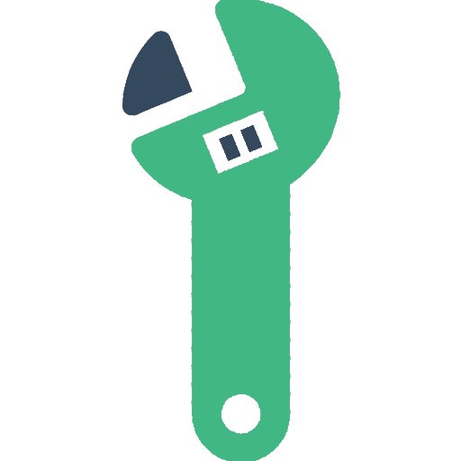
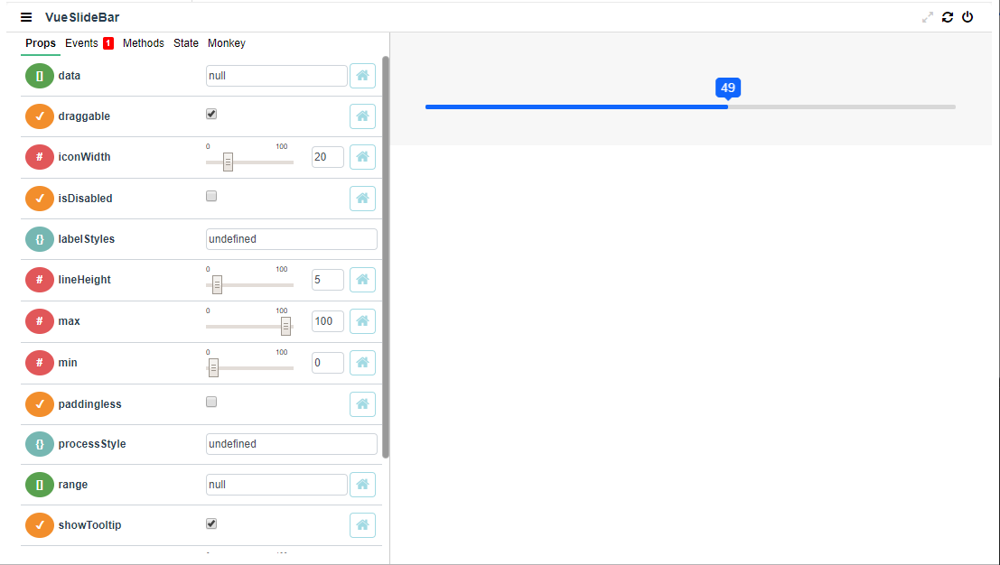

<p align="center"></p>

# Component Fixture

[](https://circleci.com/gh/David-Desmaisons/ComponentFixture)
[](https://codecov.io/gh/David-Desmaisons/ComponentFixture)
[](https://codebeat.co/projects/github-com-david-desmaisons-componentfixture-master)
[](https://github.com/David-Desmaisons/ComponentFixture/issues)
[](https://www.npmjs.com/package/component-fixture)
[](https://github.com/David-Desmaisons/ComponentFixture/blob/master/LICENSE)

## Demo

https://david-desmaisons.github.io/ComponentFixture/

## Description

Interactive test fixture for vue component.

Component is designed to receive any component you want to test as a default slot

```HTML
<sandbox>

  <!-- Use the default slot to create the component under test -->
  <component-under-test/>

</sandbox>
```
### Component-fixture will automatically:
  - Mirror all the props of the tested component
  - Bind this data to the component under-test
  - Display all the props in a form so that it is possible to edit them

### Features:
  - Respect props type and use custom input for each type
  - Provide input for objects and function
  - Create `v-model` binding if needed
  - Support of two-way data binding using the [`.sync` modifier pattern](https://vuejs.org/v2/guide/components-custom-events.html#sync-Modifier)
  - Custom props validation when available
  - Support component with slots
  - Display of all events emitted by the component
  - Display of component `data` and `computed` information
  - Exposition of component method as buttons that can be called with display of the produced result
  - Compatible with hot-reload: automatic update on changes happening on the tested component

Example using [vue-slider-component](https://github.com/NightCatSama/vue-slider-component):




## Uses cases

Why would you need such a component?

`ComponentFixture` is intended to be used only in a test/dev context with two main applications.

### Discovering third party component
  - Explore Interactively a component you are willing to use in your application.
  - Understand by example what the props role.
  - Quickly identify bugs and limitation on the component. 


### Testing a component you creates 
  - Create an example usage of your component that will update automatically
  - Interact with the component while you create it.
  - Easily identify bugs

## Next steps

  - [x] Provide a way to default component props
  - [ ] Monkey testing: use randomly generated updates on component props.

This will be provided on next major version.

## Example usage

```HTML
<sandbox :defaults="{value: 23}">

  <!-- Use the default slot to for the component under test -->
  <component-under-test></component-under-test>

</sandbox>
```

```javascript
import { Sandbox } from 'component-fixture'
import "component-fixture/dist/ComponentFixture.css"
import { componentUnderTest } from 'componentUnderTest'

export default {
  components: {
    componentUnderTest,
    Sandbox
  }
}
```

### API
#### slots 

- `default` Slot for the component under test

#### props 

- `defaults` ***Object*** (*optional*) 

  Value: `{[propName]: defaultValue}`

   Object sets to default the component under-test props. For example if you want to default the props value with 46, use:  `:defaults="{value: 46}"`

- `possibleValues` ***Object*** (*optional*) 

  Value: `{[propName]: [...values]}`

   Object used to predefined the possible values for a given props.
   The values defined by `possibleValues` will be used to create a select from the provided values for the given props.
   For example if you want to limit the props value to 1,2, 3 or 4, use:  `:possibleValues="{value: [1,2,3,4]}"`

- `componentHeight` ***String*** (*optional*) 

    Style to be applied to the component under-test height. Default to null.

- `componentWidth` ***String*** (*optional*) 

    Style to be applied to the component under-test width. Default to null.

- `useStore` ***Boolean*** (*default: false*) 

    If true and vuex is being used, a store module is automatically created and its state is bound to component props.


## Installation

```
npm install ComponentFixture
```

## Project setup

```
npm install
```

### Compiles and hot-reloads for development

```
npm run serve
```

### Compiles and minifies for production

```
npm run build
```

### Lints and fixes files

```
npm run lint
```

### Run your unit tests

```
npm run test:unit
```

### Update the API section of README.md with generated documentation

```
npm run doc:build
```

### Run style guide dev server

```
npm run styleguide
```

### Generate a static HTML style guide

```
npm run styleguide:build
```
